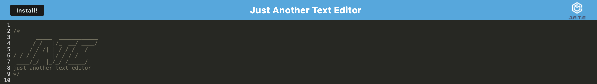

# Text Editor


## Description
The Text Editor is a progressive web application (PWA) that runs in the browser, designed for creating notes or code snippets with or without an internet connection. It features offline functionality and data persistence, providing a reliable text editing experience in various network conditions.

## Table of Contents
- [Installation](#installation)
- [Usage](#usage)
- [Credits](#credits)
- [License](#license)
- [Features](#features)
- [Contribute](#contribute)
- [Tests](#tests)
- [Questions](#questions)

## Installation
To install the necessary dependencies, run the following command:
```bash
npm install

## Usage
To use this application, follow these steps:
1. Visit the deployed application [here](https://m19c-texteditor.onrender.com/).
2. Utilize the text editor for creating notes or code snippets.
3. Your data will be saved automatically and can be accessed anytime, with or without an internet connection.

**Screenshots:**


## Credits
Developed by Isaac Masterman, utilizing technologies such as Express.js, Webpack, IndexedDB, and Service Workers.

## License
This project is licensed under the MIT License. For more information, see the [LICENSE](LICENSE) file.

## Features
- Note creation and code snippet management.
- Data persistence using IndexedDB.
- Offline functionality.
- Bundled with Webpack.
- Service worker implementation for asset caching.
- Installable as a Progressive Web Application.

## Contribute
N/A

## Tests
N/A

## Questions
If you have any questions about the project, please feel free to contact me directly at [isaacmasterman@gmail.com](mailto:isaacmasterman@gmail.com). You can also find more of my work at [isaacmasterman](https://github.com/isaacmasterman).
